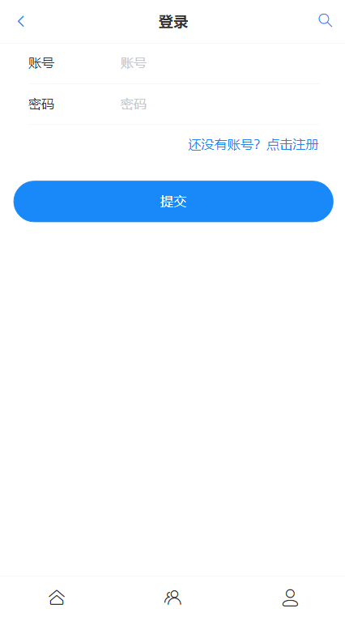
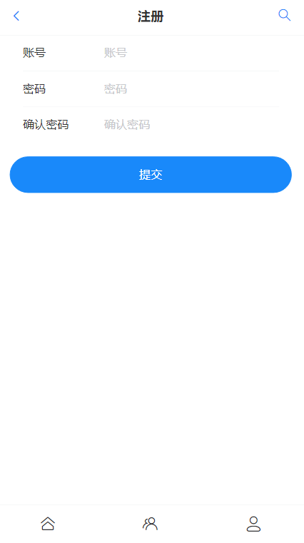
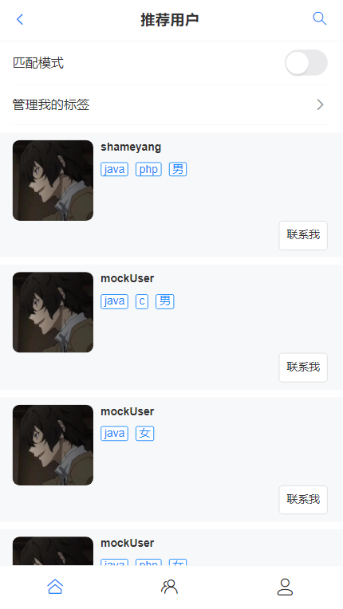
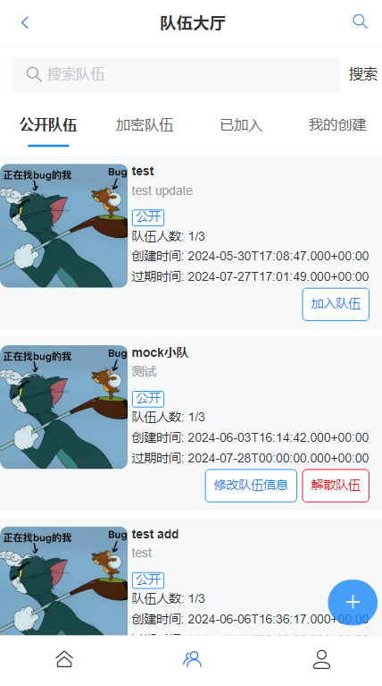
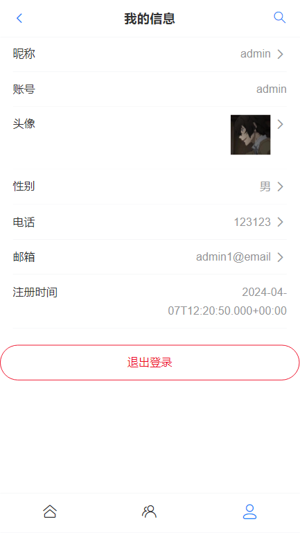
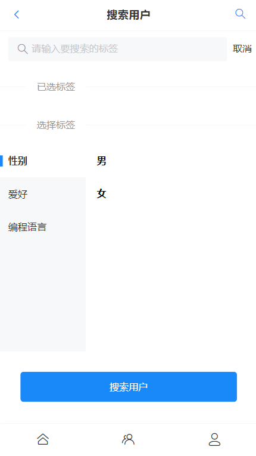

## FriendHub 伙伴匹配

## 项目介绍

基于 SpringBoot 2 + Vue 3 的伙伴匹配系统，实现了用户管理、按标签检索用户、推荐相似用户、组队等功能。

### 登录页

### 注册页

### 主页

### 组队页

### 用户页

### 搜索用户

## 技术选型

### 前端

- HTML + CSS + JavaScript 前端三件套
- Vue 开发框架
- Vant 组件库
- Vite 构建工具
- Axios 请求库

### 后端

- Java SpringBoot 框架
- MySQL 数据库
- MyBatis-Plus
- MyBatisX 插件自动生成代码
- Redis 缓存
- Redis 分布式登录
- Redisson 分布式锁
- Spring Scheduler 定时任务
- Swagger + Knife4j 接口文档
- Gson
- 相似度匹配算法

## 注意事项

- 没有提供 application.yaml 文件，请自行配置

## TODO 可优化功能

- [x] 搜索用户修改接口
  - [ ] 排除自己
  - [ ] 数据量较大时，提高搜索速度

主页

- [x] 用户修改自己的标签

- [x] 普通模式下，排除自己
- [x] 标签管理：性别可以同时选中

- [ ] 新用户主页展示空白

- [ ] 输入时，屏幕自动放大
- [ ] 标签自定义（需管理员审核）
- [ ] 主页用户，联系我功能

队伍页

- [ ] 队伍头像自定义
- [ ] 查看队友

用户页

- [x] 用户信息页，性别修改页面改为滑动选择

- [ ] 注册时间格式
- [ ] 头像上传方式修改

## BUG 清单

主页

- [x] 匹配模式，bug，标签错误

队伍页

- [x] 队伍页面首次加载问题

数据库

- [x] 逻辑删除失效